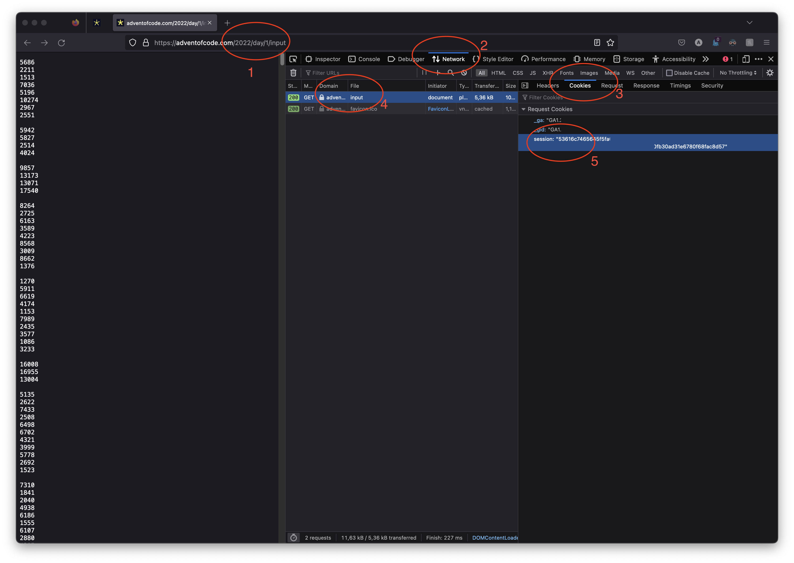

## Getting started
This deno app requests the data from the website directly. This saves the time of having to download the data and then uploading it to the app.



How to add your cookie data in the .env file: 
1. go to the input page of any 2022 problem
2. open the developer tools (F12) and go to the network tab
3. Select the first request where File is equal to "input" 
4. Click on the cookie tab
5. Copy the session cookie data and paste it in the .env file as shown in the .env.example file

| the session cookie will be 128 caracters long


## To run the app
install denon here: https://deno.land/x/denon), and run the following command:

```bash
denon start
```